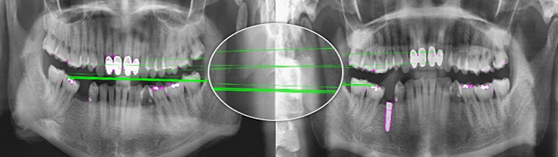
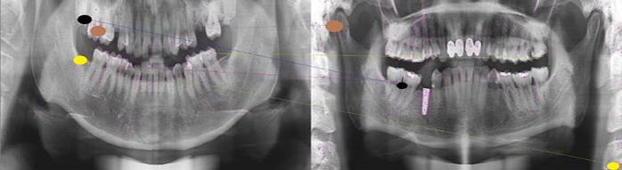
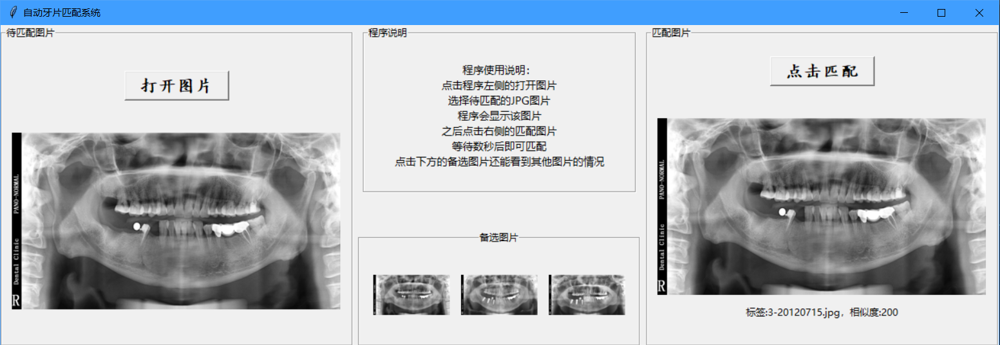
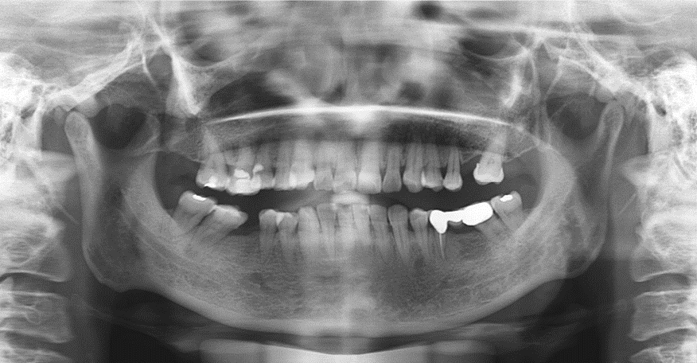
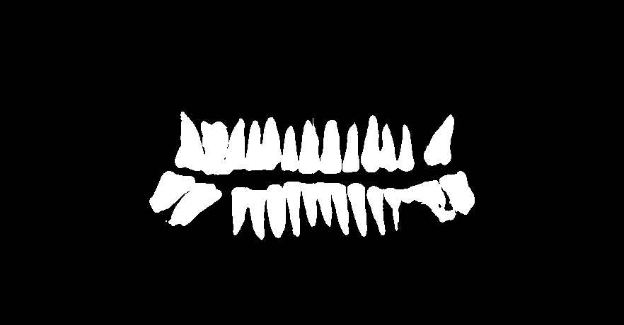

# dental_xray_match-segmenation
This repo involves two parts: matching and segmentation.

If you want to run the two programs on your own computer, please replace the file paths in the scripts to your corresponding paths.

For matching program, you firstly need to run get_all_SIFT.py to get all SIFT features for all X-rays. Features will be automatically serialized.

For segmentation program, you firstly need to run train.py with your own dataset. Then run predict.py to segment and postprocess.py to remove possible noises in the background.

# Dataset Description
Restricted by laboratory agreements, all data will not be publicized.

The dataset involves 400 people's panoramic dental X-rays from West China Hospital, Sichuan University. There are 933 X-ray images in total and one people has more than one X-ray captured in different time. P.S.: Most people have dental fillings or something that are impenetrable to X-rays. (as is shown below)

# Performance:
## Segmentation:
On the dataset above, the dice coef reaches 0.96 after careful parameter tuning.

With the image size 882 * 460, segmenting an image takes about 2s on GTX 1070.

## Matching:
On the dataset above, the top3 accuracy reaches 95%. 

With one CPU core, it only needs 3s to compare features of one image with these of the other 932, thanks to FLANN algorithm.

# Screenshot
matching demonstration---positive:

matching demonstration---negative:

**It is obvious that for two X-rays belonging to one person, any two corresponding points (points whose respective feature descriptors are similar) are at adjacent relative position in the image, and vise versa. This fact was where the idea came from.**

A screenshot of matching program:  

An example of segmentation：
The original image：  
  
The mask after segmentation：  
  
